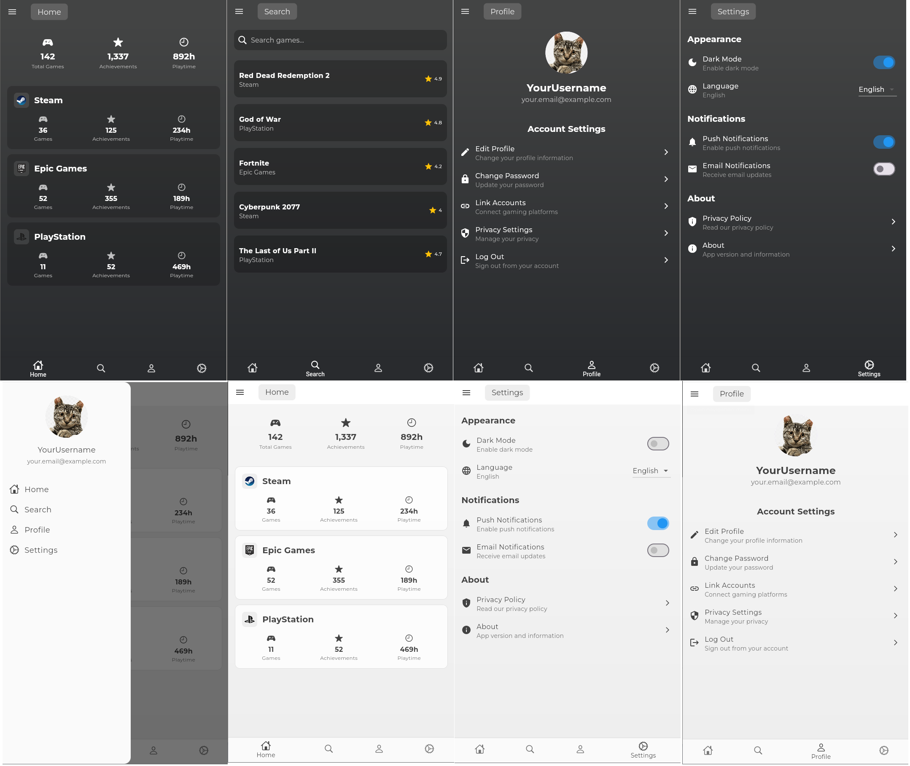

# Gamer Stash Flutter Projesi


## Proje Hakkında

Günümüzde çok fazla oyun satış platformu var, kütüphane takibi yapmak git gide zorlaştı. Oluşturulan oyuncu profillerinin,
kütüphanede sahip olunan ögelerin ve kazanılmış başarımların bir araya getirilmesi, sergilenmesi ve tek profil altında gözükmesini amaçlayan bir sosyal ağ.

- **Danışman:**  
  [https://github.com/keyvanarasteh] (Keyvan Arasteh)

- **Takım Üyeleri:**

- Mert Kuruali [https://github.com/Mertelyev]

## Özellikler

- Steam, Epic Store ve PSN oyunlarının ve başarımlarının listelenmesi

- Kullanıcı profili oluşturma

- Oyunlar ve başarımlar arasında arama yapabilme

## Kullanılan Teknolojiler

- Flutter

- Dart

## Başlangıç

### Gereksinimler

- Flutter SDK (sürüm 3.24.5)

- Dart SDK (sürüm 3.2.4)

### Kurulum Adımları

1. Projeyi bilgisayarınıza indirin:

```bash

git  clone [proje-adresi]

```

2. Proje klasörüne gidin:

```bash

cd [proje-adı]

```

3. Gerekli paketleri yükleyin:

```bash

flutter  pub  get

```

4. Uygulamayı başlatın:

```bash

flutter  run

```

## Proje Yapısı

```

lib/

├── models/ # Veri modelleri

├── screens/ # Uygulama ekranları

├── widgets/ # Tekrar kullanılabilir arayüz öğeleri

├── services/ # API servisleri

└── yardımcılar/ # Yardımcı fonksiyonlar

```

## Ekran Görüntüleri ve Demo Videosu




## Demo Video

https://github.com/user-attachments/assets/fdef0e69-c49e-4316-b33a-0a0af79e223a

## Projeye Katkı Sağlama

1. Projeyi forklayın

2. Yeni bir dal oluşturun (`git checkout -b ozellik/YeniOzellik`)

3. Değişikliklerinizi kaydedin (`git commit -m 'Yeni özellik eklendi'`)

4. Dalınıza gönderin (`git push origin ozellik/YeniOzellik`)

5. Pull Request oluşturun

## Lisans

[MIT License] kapsamında lisanslanmıştır. Daha fazla bilgi için `LICENSE` dosyasını inceleyebilirsiniz.

## İletişim

- Proje Bağlantısı: [[GitHub repository linki](https://github.com/Mertelyev/Gamer-Stash)]

## Teşekkürler

- İstinye Üniversitesi'ne destekleri için teşekkür ederiz
